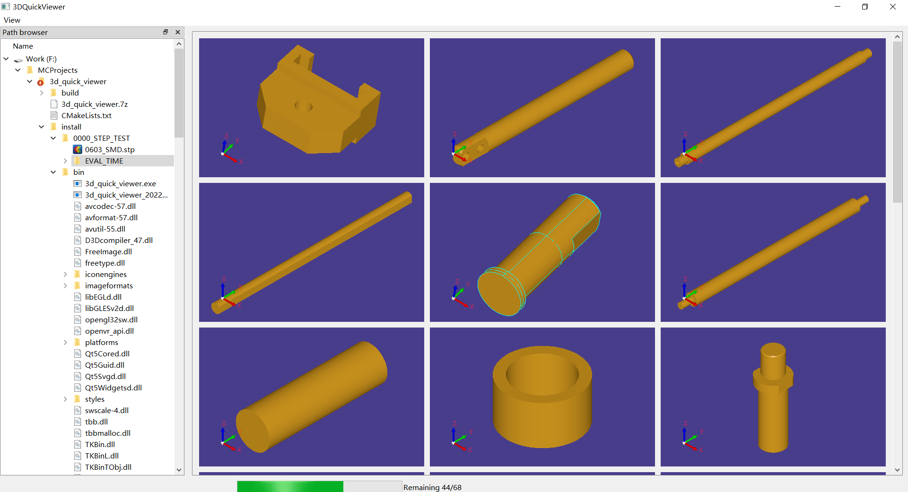
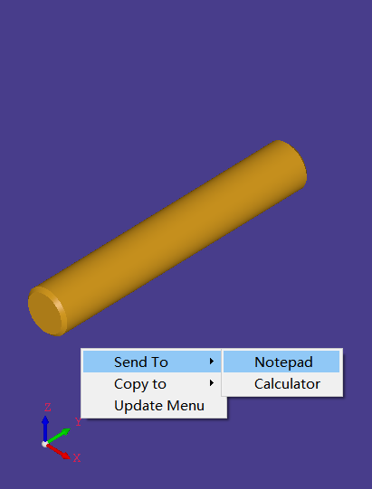
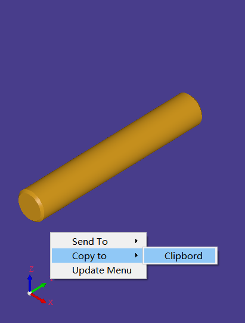

# OCCT based 3D STEP model previewer
[OCCT](https://www.opencascade.com/)

## 3d_quick_viewer
Preview 3D STEP model files in a folder, Screenshot:


## Context Menu
Configure the context menu with
> config/context_menu.json  [Example](config/context_menu.json)

And then run like this:




Every "Command" in context_menu.json works like this:
```
command <model filename>
```
where **\<model filename\>** as a command line argument.

# Dependents
Qt 5.14.2, 
OpenCascade 7.6
